# Poverty in Malawi 
Vanessa Coronado, Ethan Sager, Tianyu Bai, Daniela Nagar

## Policy Problem
Poverty in Malawi: Malawi's GDP per capita in 2024 is estimated to be between $464 and $571.93[^1]. As of 2024, World Bank projections estimate that around 72% of Malawi’s population lives in poverty, with nearly three-quarters of its people experiencing extreme poverty due to persistent food insecurity and a severe drought that has significantly affected the economy. Additionally, the country faces a substantial current account deficit, further exacerbating financial challenges. Approximately 70% of Malawians survive on less than $2.15 per day, highlighting the depth of economic hardship[^1].

### Major Causes of Poverty:
- Agricultural Dependency and Climate Shocks
- High Unemployment Rates
- Malnutrition and Disease
- Limited Access to Education and Healthcare

## Intervention 

- We are proposing to implement a Univerisal Basic Income (UBI) in the districts with the highest proportion of people in extreme poverty. 
- Give each member of a household $32.85 a month. Pay the money to the female head of household. 

## Narrative of initiative’s logic
For an adult to be past the poverty line, they would need over $2.15/day. That would cost $788.40 per year ($2.16 x 365) or $65.7 per month. We will assume that households below the poverty line currently have at least half of that amount already, or $1.08/day. We will therefore provide them with $1.08/day or $32.85/month per household member. A household of 5 people, for example, would receive $164.25/month. We will distribute the money to the female head of household for a duration of 10 years. The decision to pay the money to female heads of household is in accordance with the research that women are more likely than men to spend money in a way that benefits their children[^2]. The decision to distribute money for 10 years is in accordance with the finding that short-term UBIs were less effective than long-term UBIs[^3]. In terms of target area, we are choosing to prioritize the districts with the highest percentage of people in poverty. These districts — see table below — also have some of the highest percentage poverty gaps, or the largest distances to reach the poverty line. Based on these criteria, we identified the Phalombe, Nsanje, and Chitipa districts.

| District Name | Percent in Poverty | Poverty Gap |
|---------------|--------------------|-------------|
| Phalombe      | 83.2               | 35.1        |
| Nsanje        | 74.3               | 29.4        |
| Chitipa       | 73.8               | 25.2        |

## Theory of Change

Long-Term Goals
- Eradicate extreme poverty
    - 70% of Malawi population currently lives in extreme poverty[^1] 
- Eliminate food insecurity
    - 5.4 million people in Malawi experiencing moderate or severe chronic food insecurity[^4]
- Diversify the economy of Malawi
    - In 2023, 62% of Malawi population works in agriculture, despite climate shocks limiting its productivity[^1] 
- Empower recipients financially
    - Since a large part of the population works in agriculture, people could empower themselves by exploring profitable entrepreneurship opportunities.
- Female economic empowerment 
    - Focus on female heads of households, enhancing financial decision-making and improving family well-being.

- What is needed to achieve that goal and why?
    - Provide population living in extreme poverty with enough money to live above the $2.15/day poverty line
    - Reduced dependence on agriculture for GDP and/or protection against climate shocks.

- Contextual Assumptions
    - People living in extreme poverty don’t have enough money to change their situation and are therefore trapped in poverty
    - People living in extreme poverty lack the money to move out of rural areas to explore employment sectors outside of agriculture
    - People living in extreme poverty lack the money to invest in and increase their agricultural productivity, which could increase their long-term earnings 
    - People living in extreme poverty lack the money to protect their land from climate shocks
    - People working in agriculture do not have access to the main markets so they are not able to sell their products at fair prices because they lack information about it.

- What indicators will be used to measure outcomes?
    - Income Levels: Measure changes in household income and poverty rates.
    - Income: how much total income they receive per month.
    - Employment Rates: Track changes in employment and job creation.
    - Employment status: describe if they are employed or unemployed
    - Employment type: the sector in which they are working 
    - Nutrition: Measure improvements in food security and nutritional status, especially among children.
    - Meals per day: how many meals they have per day.
    - Food expenditure: Amount of money spent on food by households.
    - Debt Levels: Monitor changes in household debt and financial stability.
    - Debt-to-income ratio: The ratio of total household debt to total household income.

# Theory of change (Flowchart)

```mermaid
flowchart TD
    %% Long-Term Goals
    subgraph LTG["Long-Term Goals"]
      A1[Eradicate extreme poverty]
      A2[Eliminate food insecurity]
      A3[Diversify industries]
      A4[Empower recipients financially]
    end

    %% Impact
    subgraph IMP["Impact"]
      D1[Reduce number of Recipient households living in extreme poverty]
      D2[Mitigate food insecurity in Recipient households]
      D3[Recipient households seek new employment outside of farming]
      D4[Recipients are empowered financially]
    end

    %% What is Needed to Achieve the Goals
    subgraph INTO["Intermediate Outcomes"]
      F1[Income Levels: Measure changes in household income and poverty rates]
      F2[Income: Total income received per month]
      F3[Employment Rates: Track changes in employment and job creation]
      F4[Employment Status: Employed or unemployed]
      F5[Employment Type: Sector of employment]
      F6[Nutrition: Measure improvements in food security and nutrition]
      F7[Meals per Day: Number of meals per day]
      F8[Food Expenditure: Amount of money spent on food by households]
      F9[Debt Levels: Monitor changes in household debt and financial stability]
      F10[Debt-to-Income Ratio: Ratio of total household debt to total household income]
    end

    %% What is intervention
    subgraph INTER["Intervention"]
      E1[UBI to female head of households in targeted districts]
    end

    %% Contextual Assumptions
    subgraph ASSUMP["Contextual Assumptions"]
      C1[People lack sufficient funds to change their situation]
      C2[Insufficient money to move out of rural areas]
      C3[Inability to invest in improving agricultural productivity]
      C4[Inability to protect land from climate shocks]
      C5[Lack of market information limits fair pricing]
    end

    %% Connections
    ASSUMP --> INTER
    INTER --> INTO
    INTO --> IMP
    IMP --> LTG
```

## References 

[^1]: World Bank. (2024). Malawi overview. Retrieved from https://www.worldbank.org/en/country/malawi/overview#:~:text=Economic%20Overview,population%20living%20in%20extreme%20poverty.
[^2]: World Bank. (2023). How empowering women can help end poverty in Africa. Retrieved from https://blogs.worldbank.org/en/nasikiliza/how-empowering-women-can-help-end-poverty-africa.
[^3]: GiveDirectly. (2023). 2023 Universal Basic Income (UBI) results. Retrieved from https://www.givedirectly.org/2023-ubi-results/.
[^4]: Integrated Food Security Phase Classification. (2024). IPC country analysis: Kenya. Food and Agriculture Organization. Retrieved from https://www.ipcinfo.org/ipc-country-analysis/details-map/en/c/1155612/
[^5]: World Bank. (2024). Employment in agriculture (% of total employment) – Malawi. World Development Indicators. Retrieved from https://data.worldbank.org/indicator/SL.AGR.EMPL.ZS?locations=MW.
[^6]: International Food Policy Research Institute. (2019). Poverty in Malawi: 2016-2017. Retrieved from https://massp.ifpri.info/files/2019/06/Poster-on-Poverty-in-Malawi-2016-2017.pdf.

