# Theory of Change

**Authors:** Vanessa Coronado, Ethan Sager, Tianyu Bai, Daniela Nagar

---

## Policy Problem
Poverty in Malawi: Malawi's GDP per capita in 2024 is estimated to be between $464 and $571.93([World Bank, 2024](https://www.worldbank.org/en/country/malawi/overview#:~:text=Economic%20Overview,population%20living%20in%20extreme%20poverty)). As of 2024, World Bank projections estimate that around 72% of Malawi’s population lives in poverty, with nearly three-quarters of its people experiencing extreme poverty due to persistent food insecurity and a severe drought that has significantly affected the economy. Additionally, the country faces a substantial current account deficit, further exacerbating financial challenges. Approximately 70% of Malawians survive on less than $2.15 per day, highlighting the depth of economic hardship([World Bank, 2024](https://www.worldbank.org/en/country/malawi/overview#:~:text=Economic%20Overview,population%20living%20in%20extreme%20poverty)) .

## Long-Term Goals

- **Eradicate Extreme Poverty**  
  - *Objective:* Reduce extreme poverty levels  
  - *Context:* 70% of Malawi's population currently lives in extreme poverty ([World Bank, 2024](https://www.worldbank.org/en/country/malawi/overview#:~:text=Economic%20Overview,population%20living%20in%20extreme%20poverty))  

- **Eliminate Food Insecurity**  
  - *Objective:* End chronic food insecurity  
  - *Context:* 5.4 million people in Malawi are experiencing moderate or severe chronic food insecurity ([Integrated Food Security Phase Classification, 2024](https://www.ipcinfo.org/ipc-country-analysis/details-map/en/c/1155612/))  

- **Diversify Industries in Which the Malawi Population Works**  
  - *Objective:* Reduce overreliance on agriculture  
  - *Context:* In 2023, 62% of the Malawi population works in agriculture, despite climate shocks limiting productivity ([World Bank, 2024](https://data.worldbank.org/indicator/SL.AGR.EMPL.ZS?locations=MW))  

- **Empower Recipients Financially**  
  - *Objective:* Enable economic self-sufficiency  
  - *Strategy:*  
    - Encourage profitable entrepreneurship among those dependent on agriculture  

## What Is Needed to Achieve That Goal and Why?

- Provide the population living in extreme poverty with enough money to rise above the $2.15/day poverty line.
- Reduce dependence on agriculture for GDP and provide protection against climate shocks.

---

## Contextual Assumptions

- People living in extreme poverty don’t have enough money to change their situation and are therefore trapped.
- They lack sufficient funds to move out of rural areas and explore employment in other sectors.
- Insufficient capital prevents them from investing in increasing their agricultural productivity, limiting long-term earnings.
- They do not have enough money to protect their land from climate shocks.
- Agricultural workers often lack access to key markets and information, hindering their ability to sell products at fair prices.

---

## What Is the Intervention?

- **Intervention:** Universal Basic Income (UBI)  
  - **Target:** Districts with the highest proportion of people in extreme poverty ([IFPRI, 2019](https://massp.ifpri.info/files/2019/06/Poster-on-Poverty-in-Malawi-2016-2017.pdf))  
  - **Mechanism:**  
    - Provide each household member with $32.85 per month   

### Target Districts

| District Name | Percent in Poverty | Poverty Gap |
|---------------|--------------------|-------------|
| Phalombe      | 83.2%              | 35.1        |
| Nsanje        | 74.3%              | 29.4        |
| Chitipa       | 73.8%              | 25.2        |

---

---

## Narrative of Initiative’s Logic
For an adult to be above the poverty line, they would need over $2.15 per day. According to the IMF, the PPP conversion factor for Malawi in 2025 is 553.1 Malawian kwacha per US dollar, which means that in Malawi, adults with daily earnings of at least 1,189.165 Malawian kwacha are above the poverty line. This is equivalent to $0.69 (US dollars). We will assume that every household below the poverty line already has at least half of this amount per day, that is $0.35 per day. Therefore, the program will provide them with $0.35/day or $10.35/month per household member. A household of 5 people, for example, would receive $51.75/month. We will distribute the money to the head of household for a duration of 10 years. The decision to distribute money for 10 years is in accordance with the finding that short-term UBIs were less effective than long-term UBIs[^3]. In terms of target area, we are choosing to prioritize the districts with the highest percentage of people in poverty. These districts — see table below — also have some of the highest percentage poverty gaps, or the largest distances to reach the poverty line. Based on these criteria, we identified the Phalombe, Nsanje, and Chitipa districts.
### Why Choose a UBI Intervention?

- **Alleviating Poverty:**  
  - A long-term UBI can provide sustained support rather than the limitations of targeted cash transfers.
- **Evidence from Kenya:**  
  - GiveDirectly’s 12-year UBI in Kenya showed significant benefits ([GiveDirectly, 2023](https://www.givedirectly.org/2023-ubi-results/)).
- **Economic Rationale:**  
  - Malawi’s growth rate (4.6% in 2021) is lower compared to Kenya’s (7.6% in 2021) ([World Bank GDP Growth](https://data.worldbank.org/indicator/NY.GDP.MKTP.KD.ZG?end=2023&locations=KE&start=1983&view=chart)).
  - GDP per capita in 2023: $602 in Malawi vs. $1,952 in Kenya.
- **Geographical Challenges:**  
  - Malawi is landlocked, leading to higher costs and delays in imported goods ([World Bank, 2008](https://www.worldbank.org/en/news/feature/2008/06/16/landlocked-countries-higher-transport-costs-delays-less-trade)).
- **Hypothesis:**  
  - Providing a UBI in a more economically challenged environment like Malawi could lead to even more substantial growth.

### How Will the Intervention Be Carried Out?

- **Target Areas:**  
  - Prioritize districts with the highest poverty rates and largest poverty gaps: Phalombe, Nsanje, and Chitipa.
- **Payment Details:**  
  - Instead of providing the full $2.15/day, households receive $1.08/day (or $32.85/month per household member) based on the assumption that households below the poverty line already have part of the required amount.
  - For example, a household of 5 would receive $164.25 per month.
- **Distribution:**  
  - Funds will be disbursed to heads of households. 
- **Duration:**  
  - The UBI will be provided for a duration of 10 years.
- **Financial Rationale:**  
  - An adult needs over $2.15/day to be above the poverty line, which equates to $65.7 per month. Households below the poverty line are assumed to already have half that amount.

---

## Participant's Behavior and Its Impact on Outcomes

According to available data (United Nations in Malawi, 2022), very poor and poor people in Malawi spend more than half of their income (60% in urban areas and about 76% in rural areas) on food purchases, leaving little for other essential needs and limited saving capacity. Non-poor people, instead, spend 40% or less of their total income on food and they also spend on non-food items like healthcare, education, etc, and they tend to have saving patterns. Evidence from previous cash transfer programs in Malawi ([The Transfer Project, 2017](https://transfer.cpc.unc.edu/countries/malawi/)) suggest that poor and extremely poor households adjust their spending patterns directing more resources toward essential needs such as food, healthcare, and education. A significant share is reallocated to increase food consumption, often with an emphasis on more nutritious options. Additionally, they channel part of their income into small productive investments, like livestock or agricultural tools, and use it to cover school fees, which enhances their well-being and supports higher school attendance.

While our intervention prioritizes districts with the highest levels of extreme poverty, it is also crucial to consider the 20-25% of the population who do not fall into this category. Research shows that UBI’s impact varies by socio-economic status. For those in extreme poverty, it primarily covers essential needs like food, shelter, and healthcare, leading to immediate improvements in well-being. Among the poor, it can increase consumption, enable small investments, and support debt repayment. For those who are not poor, UBI may be allocated toward savings, larger investments, or discretionary spending, enhancing financial security and economic mobility. 

There is evidence of UBI interventions in low (Basic Income Grant in Namibia, 2016) and high income countries (Stockton Economic Empowerment Demonstration, 2019) and the outcomes are different in magnitude (huge impact in low-income countries and relatively small impact in high-income countries) but positive in both cases because this type of interventions not only moves people above the poverty line but reduces income inequality and increases opportunities ([UBI Advocates, 2021](https://ubiadvocates.org/why-ubi-works-hard-evidence-of-its-impact-on-poverty/?form=MG0AV3)).

---

## Why UBI Instead of a Targeted Program?

A key advantage of UBI programs is that they simplify implementation by eliminating eligibility constraints. In contrast, targeted cash transfer programs face challenges in accurately identifying beneficiaries, as the data required to determine poverty status is often complex and unreliable. This issue is particularly pronounced in the poorest countries, where limited statistical capacity makes precise targeting even more difficult and costly.

In addition, as universal interventions ensure that all individuals receive support, regardless of their socio-economic status, this can reduce social stigma and increase public support for the program, while the higher impacts are for those who need the aid the most.

Universal interventions can stimulate economic activity by increasing overall consumption and investment. This can lead to broader economic growth and development for the community where the intervention is being carried out. 

---

## Welfare Effects of the Intervention

The intervention we proposed is welfare-improving rather than just welfare-redistributing because it does not take money from one group to give to another in a way that reduces overall economic efficiency. Instead, it injects new resources into the economy by providing a steady flow of cash transfers, which can stimulate local demand, encourage investment, and lead to higher productivity.Unlike targeted cash transfer programs that can create competition for limited aid, this UBI does not displace existing income sources but rather supplements them, allowing recipients to improve their financial security and invest in their long-term well-being. The intervention also has a multiplier effect, as increased consumption and investment can drive economic growth, especially in impoverished regions. Additionally, by enabling spending on food, healthcare, and education, it contributes to long-term human capital gains, which are crucial for breaking the cycle of poverty. As Amartya Sen famously stated, “Poverty is not just a lack of money; it is not having the capability to realize one’s full potential as a human being.” By providing a sustained income, the UBI empowers recipients to make choices that enhance their well-being beyond mere survival. Because it does not compete for fixed resources or shift benefits between different regions, it avoids the inefficiencies of redistribution. However, the overall welfare improvement depends on how the program is funded—if financing comes from reductions in public services or increased taxation that negatively affects others, there could be a redistributive component that limits the program's net benefit. Thus, ensuring sustainable funding is essential for maximizing its positive impact.

## Considerations and Decision Rationale

- **Choice of UBI:**  
  - After considering various conditional transfer (CT) models, the long-term UBI route was selected for its potential to produce significant long-term impacts.
- **Contextual Differences:**  
  - Despite the benefits seen in Kenya, Malawi’s distinct economic challenges (e.g., being landlocked, lower GDP per capita) suggest the UBI could have an even more transformative effect.
- **Design Details:**  
  - The intervention provides less than the full $2.15/day to account for existing household income.

---

## Why the study matters and what we are trying to learn
First, instead of giving people the full amount to get them above the poverty line ($2.15/day or its equivalent of $0.69), the study seeks to examine how an extra boost will impact people. This is partially due to the fact that in our counties, 15-25% of the population is not in extreme poverty. We expect that those in different economic stratum will react differently to the stimulus. It’s also driven by the fact that while a huge portion of the population is in extreme poverty, we don’t know the exact amount that they are living on per day and assume it is not $0. Lastly, we hypothesize that many Malawian's people don’t need a huge amount of money to make significant improvements to their day-to-day lives.

Contextually, the study is important as this would be the first implementation of a long-term UBI in Malawi. The closest study is the UBI implemented by [Egger et al., 2022](https://onlinelibrary.wiley.com/doi/full/10.3982/ECTA17945)) in Kenya. However Kenya and Malawi differ in many ways; specifically, they are in different places financially and geographically with potential vastly different constraints on the local economy. In addition Malawi still has a huge proportion of its population working in the agricultural sector. Therefore, the impact of a UBI could be more meaningful in Malawi.

Thus, A long-term UBI could enable Malawians to invest and take risks that could spur long term growth. Malawi’s GDP growth has been low and the country continues to struggle financially. A long-term UBI here could propel more significant growth in Malawi than higher income countries, like Kenya, that have experienced long-term UBIs.

## Program Effects and Potential Externalities

### Positive Outcomes
The literature on cash transfers suggests positive multiplier effects in the local economy ([Egger et al., 2022](https://onlinelibrary.wiley.com/doi/full/10.3982/ECTA17945)). When recipients spend their UBI, it generates increased economic activity, benefiting both participants and non-participants through increased local demand and business opportunities.

### Potential Negative Externalities
1. Price Effects ([Filmer, Friedman, Kandpal, and Onishi 2021](https://direct.mit.edu/rest/article-abstract/105/2/327/100989/Cash-Transfers-Food-Prices-and-Nutrition-Impacts?redirectedFrom=fulltext))
    - Local inflation could occur if supply chains cannot meet increased demand
    - Non-recipient households might face higher prices for goods and services

2. Migration Effects
    - Program might attract people from non-participating districts
    - Could strain local resources and infrastructure

### Universal vs Targeted Benefits
Universal coverage in the selected districts offers several advantages:
- Reduces stigma associated with receiving
- Eliminates costly targeting mechanisms and oversight
- Creates community-wide effects that can benefit even non-poor households
- Allows study of impacts across different economic strata

### Employment Mechanisms
Current barriers to employment include:
- Lack of capital for:
    - Transportation to job opportunities
    - Starting small businesses
    - Skills training or education
- Risk aversion due to income insecurity
- Minimal local demand

UBI could address these by:
- Providing working capital
- Creating safety net for risk-taking
- Fostering demand in the local economy

### Non-Poor Population Considerations
For the 25% not in extreme poverty, UBI could:
- Enable business expansion
- Increase hiring capacity
- Foster local economic growth
- Create new market opportunities
- Drive demand for businesses run by the poorest in the region
- Protect those whom would be close to the cut off, as [Beegle et al., (2017)](https://ideas.repec.org/a/eee/deveco/v128y2017icp1-23.html) highlighted the issue of decreased food security for non-benficary households in Malawi from a CCT. 

These effects could generate positive spillovers for the entire community while providing valuable research insights across economic strata.

## Design and Randomization

### Randomization Level
Randomization will occur at the village level. While other methods were considered, this will be the simplest way of executing the program. Villages will be chosen randomly to avoid any bias toward certain socioeconomic or demographic groups. In treatment villages, all households will receive payments. Each household will receive $o.35/day per household member. Household members include family members of the head of household or people who have been living together for at least 6 months (Beaman & Dillon, 2011).

- Cluster Randomization: The study will randomize at the village level, with 60 villages (30 treatment and 30 control) across the three target districts (Phalombe, Nsanje, and Chitipa).
- Sample Size: Each village will have approximately 250 households, resulting in a total sample size of 15,000 households (7,500 in treatment and 7,500 in control).
  
### Determining Sample Size Using Power and MDE
As mentioned above, the number of households that will be in the treatment group is 7,500. We will verify that our sample size is sufficiently large by calculating the MDE needed to achieve 80% power. In order to determine our MDE, we will calculate the treatment effect on an average Malawian household. 

The average Malawian household has approximately 4 members. Given that we are providing $0.35 per day per household member, that would total $1.40 per day for the average household. As mentioned previously, 85% of the population we are treating earns less than $0.69 per day. Thus, in providing these households with $1.40, we are giving them an additional 200% on top of their original income. Assuming Malawians spend 80% of their income on consumption, an additional $1.40 per day would increase their consumption spending by $1.12 (0.8 x $1.40). 

Our null hypothesis would be that our treatment effect is  $0.00. Our alternative hypothesis would be that our treatment effect is greater than $0.00 (specifically, $1.12). Given that we expect an effect of $1.12, our standard deviation would be $0.20 and our MDE would be 2 or $0.40. This means that even if our treatment effect isn’t $1.12, we want to be able to detect any treatment effect greater than or equal to $0.40. 

In order to determine whether our sample size is sufficient for an MDE of 2 where standard deviation is $0.20 and power at 80%, we will run a power calculation in Stata. This will tell us exactly how large of a sample size we need. We will then adjust the sample size accordingly. 

### Measuring Spillovers
To account for spillover effects, as the study is conducted we will monitor the incomes and growth levels among the control villages. We will look out for patterns such as heightened earnings among control villages neighboring treatment villages. If we find this or any other bias, we will identify such spillover effects in the findings in our study.

- Spillover Effects: Spillovers will be measured by comparing outcomes in control villages with those in treatment villages
- Key Indicators: Local market prices, employment rates, and business activity will be used to measure spillover effects.

## Data Collection Process 

The primary data source to understand the impact of our UBI on welfare in Malawi will be household surveys. We will conduct seven household surveys over the course of the 12-year intervention to both our treatment and control groups. These surveys would be conducted at baseline and at the 6 month mark, 1 year mark, 3 year mark, 6 year mark, 9 year mark, and the 12 year mark after the last cash transfer has been distributed. In additon to the baseline in order to gernarate a usable sampling frame we will conduc a hosehold census of all households within the targeted districts. This allows us to draw from the most accurate data when sampling for treatment and control. There is no household eligibility criteria beside being with the sample univerise (i.e. being enumerated within the census) if a village is selected all households within the village are treated. Across surveys if possible we attempt to survey the same intial respondent from the baseline, to retain some intersurvey validty.

In these surveys, we will ask questions that measure whether the indicators we are interested in change as a result of the cash transfer. Our indicators are listed below: 

### Intermediate Indicators 
- What indicators will be used to measure outcomes?
    - Employment:
        - Employment status (employed/unemployed)
        - Sector of employment

    - Business Growth:
        - Business ownership
        - Business metrics (assets, revenue, employees)
        - Market prices (inputs and outputs)

    - Market Access:
        - Where do you shop
        - What do you purchase
        - Product Prices

    - Food Security:
        - Number of meals per day
        - Food expenditure as percentage of income
        - Nutritional status, especially for children

    - Financial Health:
        - Debt-to-income ratio
        - Savings account balances
        - Bank account ownership
        - ROSCA participation

Our main method of measuring changes among these indicators is simply by asking participants whether they have seen changes in any of these areas. For example, we would ask participants what their employment status was before and after the cash transfer and whether the sector they are employed in has changed. However, for the product prices indicator which is in the market access section, we would also measure it using the *"mystery shopper"* tecnique which is the more accurate approach to price measurement because it accurately capture mean prices paid by customers controlling by product attributes that may affect prices, such as quality, branding, and supply-chain dynamics (Fitzpatrick, 2023).

### Outputs After the Intervention
- We will use income level and income change variables as a manipulation check, to confirm that the intervention had the desired effect.
- **Income Levels:**  
  - Total income received per month  
- **Income Change:**  
  - Changes in household income and poverty rates
     
## Cost-Benefit Analysis

At the outset of the program, we will  split the costs of funding the program with the Malawian government, with them paying 25% of the costs and our NGO paying 75%. Over the course of the 10 years, we will gradually transfer full financial responsibility to the government. More specifically, at the end of the first 5 years the Malawian government will be expected to pay 50% of the program costs, followed by a 10% increase each year thereafter.

The government will be able to afford this cost through international donors and international organization loans to acquire necessary initial capital. We also anticipate a multiplier effect from the UBI investment in the second half of the program that will enable the government to funnel more tax revenue toward the program in the future due to the positive impact in the economy.

### Cost of the implementation
#### Administrative Costs: 
- Distribution Mechanism: Mobile money transfers are the most cost-effective method, with administrative costs estimated at 5-10% of the total transfer amount. The World Bank has extensively studied the cost-effectiveness of mobile money transfers in low-income countries. According to their reports, mobile money systems typically have administrative costs ranging from 5-10% of the total transfer amount, depending on the scale and infrastructure.
- Monitoring and Evaluation (M&E): The Transfer Project, which evaluates cash transfer programs in Africa, estimates that robust M&E systems for large-scale programs typically cost between 500,000 and 1,000,000 annually, depending on the complexity and scope of the evaluation. 
Staffing and Training: UNICEF’s reports on cash transfer programs in Malawi and other African countries estimate that staffing and training costs for program implementation typically range from 200,000 to 400,000 annually, depending on the number of staff and the complexity of training required.
#### UBI transfer costs:
- Monthly UBI Amount: $0.35/day  or $10.35/month per household member.
- Household Size: Assuming an average household size of 5, each household receives $51.75/month.
- Total Annual Cost: We are assuming 7500 households in treatment, so the annual cost is approximately $388.2 thousands.
- Total 10-Year Cost: Over 10 years, the total transfer cost would be $3.9 millions.
### Funding Sources
#### Initial Phase (Years 1-5):
- External Funding (75%): International donors and NGOs will cover 75% of the costs.
- Malawian Government (25%): The government will fund 25% of the costs through business Loans. The government will take out low-interest loans from international financial institutions to cover its share.
#### Transition Phase (Years 6-10):
- Year 6: The government will increase its contribution to 50% of the program costs.
- Years 7-10: The government’s share will increase by 10% annually, reaching 100% by Year 10.
    - Multiplier Effect: The UBI’s economic multiplier effect (estimated at 1.5-2.5x) will generate additional economic activity, further increasing the tax base. The UBI is expected to stimulate local economies, leading 
      to higher GDP growth. For example, if Malawi’s GDP grows by 2-3% annually due to the UBI, the government could allocate a portion of the increased tax revenue to fund the program. As more people move out of poverty 
      and into formal employment, the tax base will expand, providing a sustainable source of funding for the UBI.

# Theory of change (Flowchart)

```mermaid
flowchart TD
    %% Long-Term Goals
    subgraph LTG["Long-Term Goals"]
      A1[Eradicate extreme poverty]
      A2[Eliminate food insecurity]
      A3[Diversify industries]
      A4[Empower recipients financially]
    end

    %% Impact
    subgraph IMP["Impact"]
      D1[Reduce number of Recipient households living in extreme poverty]
      D2[Mitigate food insecurity in Recipient households]
      D3[Recipient households seek new employment outside of farming]
      D4[Recipients are empowered financially]
    end

    %% What is Needed to Achieve the Goals
    subgraph INTO["Intermediate Outcomes"]
    B1[Consumption: Track household consumption and expenditure levels]
    B2[Employment: Monitor job status, business ownership, and market dynamics]
    B3[Food Security: Assess meals per day, nutrition, and food expenditure]
    B4[Financial Health: Measure savings, debt ratio, and female financial control]
    B5[Business Growth: Track assets, revenue, and employee metrics]
    B6[Prices: Monitor input/output prices]
    B7[Financial Inclusion: Track bank accounts and ROSCA participation]
    end

    %% What is Needed to Achieve the Goals
    subgraph OUT["Outputs"]
      F1[Income Levels: Measure changes in household income and poverty rates]
      F2[Income: Total income received per month]
    end


    %% What is intervention
    subgraph INTER["Intervention"]
      E1[UBI to head of households in targeted districts]
    end

    %% Contextual Assumptions
    subgraph ASSUMP["Contextual Assumptions"]
      C1[People lack sufficient funds to change their situation]
      C2[Insufficient money to move out of rural areas]
      C3[Inability to invest in improving agricultural productivity]
      C4[Inability to protect land from climate shocks]
      C5[Lack of market information limits fair pricing]
    end

    %% Connections
    ASSUMP --> INTER
    INTER --> OUT
    OUT --> INTO
    INTO --> IMP
    IMP --> LTG
```    

## References

- [World Bank. (2024). Malawi overview.](https://www.worldbank.org/en/country/malawi/overview#:~:text=Economic%20Overview,population%20living%20in%20extreme%20poverty)
- [Integrated Food Security Phase Classification. (2024). IPC country analysis: Kenya.](https://www.ipcinfo.org/ipc-country-analysis/details-map/en/c/1155612/)
- [World Bank. (2024). Employment in agriculture (% of total employment) – Malawi.](https://data.worldbank.org/indicator/SL.AGR.EMPL.ZS?locations=MW)
- [International Food Policy Research Institute. (2019). Poverty in Malawi: 2016-2017.](https://massp.ifpri.info/files/2019/06/Poster-on-Poverty-in-Malawi-2016-2017.pdf)
- [GiveDirectly. (2023). 2023 Universal Basic Income (UBI) results.](https://www.givedirectly.org/2023-ubi-results/)
- [World Bank Open Data. (n.d.).](https://data.worldbank.org/indicator/NY.GDP.MKTP.KD.ZG?end=2023&locations=KE&start=1983&view=chart)
- [Landlocked countries: higher transport costs, delays, less trade. (2022, March 28).](https://www.worldbank.org/en/news/feature/2008/06/16/landlocked-countries-higher-transport-costs-delays-less-trade)
- [United Nations Malawi. (2022). Malawi IPC Chronic Food Insecurity Report.](https://malawi.un.org/en/182748-malawi-ipc-chronic-food-insecurity-report-may-2022)
- [The Transfer Project. (2017). Malawi’s Social Cash Transfer Programme.](https://transfer.cpc.unc.edu/countries/malawi/)
- [Egger et al., 2022](https://onlinelibrary.wiley.com/doi/full/10.3982/ECTA17945)
- [Banerjee et al., 2019](https://www.nber.org/system/files/working_papers/w25598/w25598.pdf)
- [Beegle et al., (2017)](https://ideas.repec.org/a/eee/deveco/v128y2017icp1-23.html)
- [Filmer, Friedman, Kandpal, and Onishi 2021](https://direct.mit.edu/rest/article-abstract/105/2/327/100989/Cash-Transfers-Food-Prices-and-Nutrition-Impacts?redirectedFrom=fulltext)
- [Society for Community Research and Action. (2019). How Universal Approaches Can Maximize Prevention Efforts.](https://www.communitypsychology.com/universal-approaches/?form=MG0AV3)
- [UBI Advocates. (2024). Why UBI Works: Hard Evidence of its Impact on Poverty.](https://ubiadvocates.org/why-ubi-works-hard-evidence-of-its-impact-on-poverty/?form=MG0AV3)
- [UBI Advocates. (2024). Can UBI Reduce Income Inequality?](https://ubiadvocates.org/can-ubi-reduce-income-inequality/?form=MG0AV3)
- [International Monetary Fund, 2025. Malawi Datasets.](https://www.imf.org/external/datamapper/profile/MWI#:~:text=Real%20GDP%20growth,Malawi)
- [Fitzpatrick1, 2023. Which price is right? A comparison of three standard approaches to measuring prices.](https://www-sciencedirect-com.proxy.library.georgetown.edu/science/article/pii/S0304387823000615)

